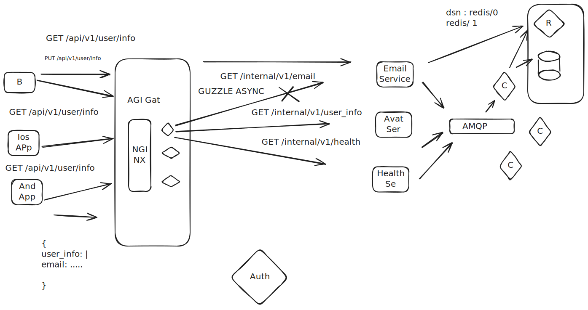

## Requirements
 - PHP 8.2 or higher
 - Composer
 - Symfony CLI 

## Installation

``shell
   mdkir -p betterme-test && cd betterme-test
   git clone <repository-url>
   cd betterme-test
``

Configure environment variables
```shell
   cp .env.dev .env
````

## Running the Application

```shell
 make start-main
 make start-internal
```

## API Endpoints
Endpoint: GET /api/v1/user-profile/{user_id}
Retrieves user profile data for a specific user ID by UUID.
If you want generate UUID, you can use https://www.uuidgenerator.net/

**Parameters:**
user_id (path parameter, required): The ID of the user

**Response:**
- 200 OK: Successfully retrieved user profile
- 400 BAD REQUEST: Validation error

Example:
```json
{
    "id":"1707ad6d-f85e-4b25-8a32-41dfb7799ffd",
    "email":"test@test.com",
    "name":"John Foo",
    "avatar":"https:\\/\\/i.pravatar.cc\\/300",
   "unknown":"alien"
}
```

### Testing with cURL

Succesful request:
```shell
curl -X GET "http://localhost:8000/api/v1/user-profile/1707ad6d-f85e-4b25-8a32-41dfb7799ffd" -H "accept: application/json"
```

Invalid request:
```shell
curl -X GET "http://localhost:8000/api/v1/user-profile/1707ad6" -H "accept: application/json"
```

## Adding New Sources/Endpoints
1. Extend the `src/Presentation/Dummy/SampleController.php` with new methods
2. Add a new `DEFAULT_URI_SOURCE_` to the `env` file
3. Add new argument to the `baseEndoints`  in the `config/services.yaml` file
4. Run command `php bin/console cache:clear`
5. Add new server to the `Makefile` in the `start-internal` target


## System Design Diagram
